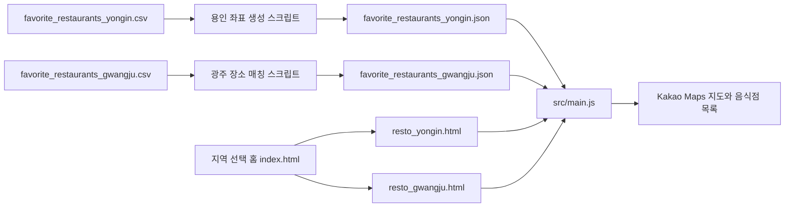

# 경기도 맛집지도 프로젝트 설명서

## 1. 프로젝트 소개

용인시와 경기도 광주시의 음식점 정보를 지도와 목록으로 보여주는 반응형 웹 앱입니다. Vite로 빌드하고, Kakao Maps JavaScript API로 지도와 마커를 표시합니다.

홈에서 지역을 고르면 지역별 지도 화면으로 이동합니다. 음식점명이나 주소를 검색하고, 카테고리별로 목록을 좁히거나, 내 위치를 지도에서 확인할 수 있습니다. 음식점의 Kakao Maps 링크도 열 수 있습니다.

현재 포함된 JSON 데이터에는 용인 음식점 490곳, 광주시 음식점 162곳이 있습니다. 홈 화면 카드에 표시된 숫자(용인 119, 광주 66)는 HTML에 직접 입력된 안내 문구여서 실제 데이터 개수와 자동으로 연동되지 않습니다.

## 목차

1. [프로젝트 구조와 데이터 흐름](#2-프로젝트-구조)
2. [실행 환경과 키 설정](#3-실행-환경-및-kakao-설정)
3. [설치와 실행](#4-설치-및-개발-서버-실행)
4. [화면 사용법](#5-화면-기능)
5. [데이터 형식과 갱신](#6-데이터-형식-및-갱신)
6. [빌드와 배포](#8-빌드-및-배포)
7. [문제 해결](#9-문제-해결)

## 2. 프로젝트 구조

```text
.
├── index.html                         # 지역 선택 홈
├── resto_yongin.html                  # 용인시 지도 페이지
├── resto_gwangju.html                 # 광주시 지도 페이지
├── src/
│   ├── main.js                        # 페이지 설정, 데이터 로드, 검색·필터·화면 동작
│   ├── map.js                         # Kakao Maps SDK 로드와 지도 초기화
│   ├── markers.js                     # 음식점 마커와 지도 정보 창
│   ├── places.js                      # CSV 파싱, Kakao 장소 검색, 주소 좌표 변환
│   ├── geolocation.js                 # 브라우저 현재 위치 표시
│   ├── style.css                      # 지도 페이지 스타일
│   ├── landing.css                    # 홈 페이지 스타일
│   └── data/
│       ├── favorite_restaurants_yongin.json  # 앱에서 사용하는 용인 데이터
│       ├── favorite_restaurants_gwangju.json # 앱에서 사용하는 광주시 데이터

├── 맛집정보/
│   ├── favorite_restaurants_yongin.csv  # 용인 원본 데이터
│   └── favorite_restaurants_gwangju.csv # 광주시 원본 데이터
├── scripts/
│   └── convert_favorite_restaurants.py # CSV를 JSON으로 변환하는 보조 스크립트
├── .env.example                        # Kakao 키 설정 예시
├── package.json                        # npm 명령과 프로젝트 설정
├── package-lock.json                   # 의존성 버전 잠금
└── vite.config.js                      # 다중 페이지 빌드 설정
```

앱은 `src/main.js`에서 두 `favorite_restaurants_*.json` 파일을 불러옵니다. `yongin-restaurants.json`과 `gwangju-restaurants.json`은 현재 페이지에서 사용하지 않는 이전 파일입니다. CSV를 바꿔도 JSON은 자동으로 바뀌지 않으므로, 데이터 갱신 절차에 따라 JSON을 다시 만들어야 합니다.

`yongin_geocoder.html`은 Vite 앱과 별도로 동작하는 오래된 수동 좌표 변환 도구입니다. 일반적인 웹 앱 실행에는 필요하지 않습니다.

`scripts/convert_favorite_restaurants.py`는 npm 명령에 연결되지 않은 보조 도구입니다. 기본 입력과 출력 경로는 용인 파일이지만, 생성 레코드의 ID·도시·source 표시는 광주로 고정되어 있습니다. 표준 데이터 갱신에는 아래의 `npm run data:geocode` 명령을 사용하세요.

### 데이터 흐름



웹 앱은 별도 백엔드나 런타임 CSV 서버 없이 JSON 파일을 번들에 포함해 사용합니다. 도시 페이지는 `data-city` 값으로 용인 또는 광주 설정을 선택합니다.

## 3. 실행 환경 및 Kakao 설정

- Node.js 22.13 이상과 npm
- Kakao Developers 앱의 JavaScript 키
- 좌표 생성 명령을 실행할 경우 Kakao REST API 키
- Kakao Developers의 Web 플랫폼에 등록된 로컬 및 배포 도메인

프로젝트 루트에서 `.env.example`을 복사해 `.env`를 만들고 실제 키를 입력합니다.

```env
VITE_KAKAO_MAP_API_KEY=발급받은_JavaScript_키
KAKAO_REST_API_KEY=발급받은_REST_API_키
```

PowerShell에서는 다음 명령으로 예시 파일을 복사할 수 있습니다.

```powershell
Copy-Item .env.example .env
```

`VITE_KAKAO_MAP_API_KEY`는 브라우저에서 Kakao Maps SDK를 불러올 때 사용됩니다. Kakao Developers에서 사용할 도메인을 허용 목록에 등록하세요. 브라우저에 전달되는 키이므로 도메인 제한을 설정해야 합니다. `KAKAO_REST_API_KEY`는 데이터 생성 스크립트에서 사용하며 `VITE_` 접두사를 붙이지 않습니다. 기존 JSON 데이터를 사용하는 웹페이지 실행에는 REST 키가 필요하지 않습니다.

`.env`는 저장소에 커밋하지 마세요. `.gitignore`에서 제외하도록 설정되어 있습니다.

## 4. 설치 및 개발 서버 실행

```bash
npm install
npm run dev
```

터미널에 표시된 로컬 주소를 엽니다. 기본 Vite 주소는 `http://localhost:5173`입니다.

- 홈: `/`
- 용인 지도: `/resto_yongin.html`
- 광주시 지도: `/resto_gwangju.html`

홈 화면에서 지역 카드를 선택해도 각 지도 페이지로 이동할 수 있습니다. `.env`를 수정한 경우 개발 서버를 다시 시작하세요.

Vite 앱을 실행하지 않고 `yongin_geocoder.html` 수동 도구를 사용할 때는 프로젝트 루트에서 별도 정적 서버를 시작합니다.

```powershell
py -m http.server 8000 --bind 127.0.0.1
```

그 뒤 `http://localhost:8000/yongin_geocoder.html`을 열고, 페이지에서 JavaScript 키를 입력해 연결한 다음 주소 변환과 CSV 다운로드를 진행합니다. Kakao Developers에 `http://localhost:8000` 도메인을 등록해야 합니다. 이 도구는 Vite 앱의 데이터 갱신 명령과 독립적으로 동작합니다.

## 5. 화면 기능

- 검색창에서 음식점명 또는 주소를 입력해 목록을 검색합니다.
- 카테고리 버튼으로 전체, 한식, 중식, 일식, 양식, 간식, 분식, 아시아음식을 필터링합니다.
- 목록 항목이나 지도 마커를 선택해 해당 위치를 확인합니다.
- 음식점의 Kakao 장소 정보가 있으면 Kakao Maps 상세 페이지를 새 창으로 엽니다.
- **내 위치** 버튼을 누르고 브라우저 위치 권한을 허용하면 현재 위치로 지도를 이동합니다.
- 좁은 화면에서는 **목록 보기** 버튼으로 목록 패널을 열고 닫습니다.

현재 위치 기능은 HTTPS 또는 localhost 같은 보안 컨텍스트에서 사용해야 합니다. 브라우저의 팝업 차단이 켜져 있으면 Kakao 장소 페이지가 열리지 않을 수 있습니다.

## 6. 데이터 형식 및 갱신

원본 CSV는 UTF-8 형식이며, 현재 파일에는 다음 열이 있습니다.

```text
추천소스, 시군, 카테고리, 음식점명, 별점, 리뷰수, 도로명주소, 지번주소,
전화번호, 경도, 위도, 카카오맵URL, 수집일시
```

앱은 빌드 시 포함된 JSON 데이터를 우선 사용합니다. 지역별 데이터 생성 명령은 다음과 같습니다.

```bash
npm run data:geocode
npm run data:geocode:gwangju
```

- `npm run data:geocode`: `맛집정보/favorite_restaurants_yongin.csv`를 읽고 Kakao API로 좌표를 조회해 `src/data/favorite_restaurants_yongin.json`을 씁니다.
- `npm run data:geocode:gwangju`: `맛집정보/favorite_restaurants_gwangju.csv`의 음식점명과 주소를 Kakao 장소와 비교해 `src/data/favorite_restaurants_gwangju.json`을 씁니다. 결과 JSON에는 매칭된 목록과 미매칭 목록이 포함됩니다.

두 명령은 `.env`의 `KAKAO_REST_API_KEY`를 사용하고 네트워크 API 요청을 보냅니다. CSV만 수정하고 JSON을 갱신하지 않으면 기존 JSON을 계속 표시합니다. JSON을 갱신한 뒤에는 개발 서버 화면을 새로고침하고, 배포 사이트는 다시 빌드해 배포해야 합니다.

좌표 생성 스크립트는 CSV에 이미 경도·위도가 있더라도 Kakao REST API에 주소 또는 장소를 조회합니다. API 키, 네트워크 연결, Kakao API 이용 가능 상태를 확인한 뒤 실행하세요.

JSON 음식점 항목에는 보통 `id`, `name`, `rating`, `address`, `category`, `lat`, `lng`가 포함됩니다. 원본에 따라 `reviewCount`, `phone`, `url`, `kakaoId` 같은 추가 정보도 포함됩니다. 지도 화면은 `restaurants` 배열의 음식점만 표시합니다.

용인 데이터 JSON을 사용할 수 없는 경우 앱은 용인 CSV를 읽어 좌표가 이미 포함되어 있으면 그 좌표를 사용합니다. 좌표가 없으면 Kakao 지도 주소 검색을 시도하고 결과를 브라우저 `localStorage`에 저장합니다. 광주 JSON에 음식점 데이터가 없으면 좌표 생성 명령을 안내하는 오류를 표시합니다.

## 7. npm 명령

| 명령 | 설명 |
| --- | --- |
| `npm run dev` | Vite 개발 서버를 실행합니다. |
| `npm run build` | 홈·용인·광주시 페이지를 `dist/`에 빌드합니다. |
| `npm run preview` | 빌드된 `dist/` 결과를 로컬에서 미리 봅니다. 먼저 `npm run build`를 실행해야 합니다. |
| `npm run data:geocode` | 용인 CSV를 Kakao API로 조회해 JSON을 갱신합니다. |
| `npm run data:geocode:gwangju` | 광주시 CSV의 Kakao 장소를 매칭해 JSON을 갱신합니다. |

## 8. 빌드 및 배포

```bash
npm run build
npm run preview
```

`dist/` 안에 생성된 정적 파일을 웹 호스팅에 배포합니다. 배포 도메인을 Kakao Developers의 Web 플랫폼에 등록해야 지도가 정상적으로 표시됩니다. 실제 운영 도메인에서 홈, 두 지역 지도, 검색, 카테고리 필터, Kakao 링크, 현재 위치 기능을 확인하세요.

## 9. 문제 해결

### 지도가 표시되지 않음

- `.env`의 `VITE_KAKAO_MAP_API_KEY`가 JavaScript 키인지 확인합니다.
- 현재 접속 주소가 Kakao Developers의 Web 플랫폼 허용 도메인에 등록되어 있는지 확인합니다.
- `.env` 변경 후 개발 서버를 다시 시작하고 브라우저 개발자 도구의 오류를 확인합니다.

### 좌표 JSON 생성이 실패함

- `.env`에 `KAKAO_REST_API_KEY`를 설정했는지 확인합니다.
- 스크립트에서 사용하는 CSV 파일명과 필수 열이 현재 원본과 일치하는지 확인합니다.
- 네트워크 상태, Kakao API 응답 제한 및 터미널 오류를 확인합니다.

### 음식점이 보이지 않거나 개수가 다름

- 현재 앱에서 가져오는 `src/data/favorite_restaurants_*.json`의 `restaurants` 배열을 확인합니다.
- CSV를 수정했다면 해당 지역 JSON을 다시 생성했는지 확인합니다.
- 홈 카드에 표시되는 숫자는 데이터 배열에서 계산하지 않고 HTML에 직접 입력되어 있습니다.
- 광주시 데이터의 미매칭 항목은 `unmatchedRestaurants`에 기록되며 지도에는 표시되지 않습니다.

### 내 위치를 사용할 수 없음

- 브라우저의 위치 권한과 기기의 위치 서비스를 확인합니다.
- HTTPS 또는 localhost에서 접속해야 브라우저 위치 기능을 사용할 수 있습니다.

### Kakao 장소 페이지가 열리지 않음

- 브라우저에서 팝업을 허용합니다.
- 음식점 JSON에 `url` 또는 `kakaoId`가 있는지 확인합니다. 두 값이 없으면 Kakao 장소 검색 결과가 필요할 수 있습니다.

## 10. 주요 수정 위치

- 홈 화면과 지역별 표시 문구: `index.html`, `resto_yongin.html`, `resto_gwangju.html`
- 홈 화면의 카드 숫자와 설명: `index.html`
- 도시별 좌표와 데이터 선택: `src/main.js`
- 지도 중심·확대 단계: `src/main.js`, `src/map.js`
- 검색, 카테고리, 목록과 상세 연결: `src/main.js`
- CSV 파싱과 Kakao 검색·주소 변환: `src/places.js`
- 마커와 지도 정보 창: `src/markers.js`
- 현재 위치 처리: `src/geolocation.js`
- 화면 스타일: `src/style.css`, `src/landing.css`
- 원본 음식점 데이터: `맛집정보/favorite_restaurants_*.csv`
- 앱에서 사용하는 데이터: `src/data/favorite_restaurants_*.json`
- 좌표 생성 스크립트: `scripts/geocode-*.mjs`
